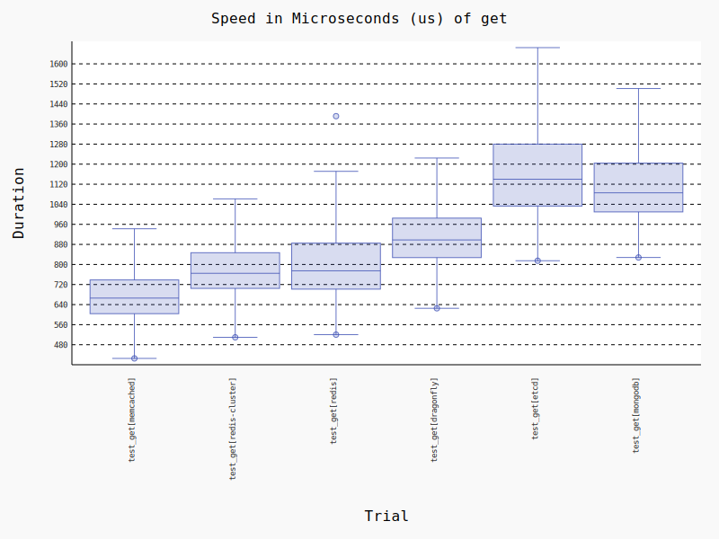
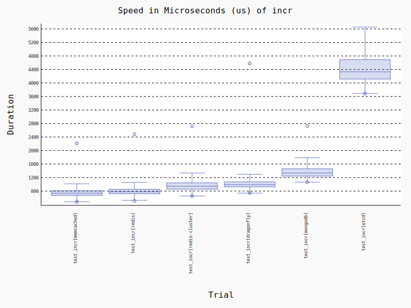

# Key Value Store benchmarks with python client libraries

Benchmarks for some common operations with Memcached, Redis, Redis Cluster, MongoDB and Etcd.

Python client libraries used:
- Redis: [redis-py](https://www.google.com/search?client=firefox-b-d&q=github+redispy)
- Memcached: [pymemcache](https://github.com/pinterest/pymemcache)
- MongoDB: [pymongo](https://github.com/mongodb/mongo-python-driver)
- Etcd: [etcd3](https://github.com/kragniz/python-etcd3)

The associated wrappers used in the benchmark can be found in [kv_benchmark.py](./kv_benchmark.py)

## Get


## Set


## Atomic Increment


## Tabulated Results

```

----------------------------------------------- benchmark 'get': 6 tests -----------------------------------------------
Name (time in us)                Min                   Max                Mean            Rounds  OPS (Kops/s)          
------------------------------------------------------------------------------------------------------------------------
test_get[memcached]          47.9892 (1.0)        211.0489 (1.0)       72.5433 (1.0)       20488       13.7849 (1.0)    
test_get[redis]              63.7602 (1.33)       237.0942 (1.12)     103.2820 (1.42)      15568        9.6822 (0.70)   
test_get[redis-cluster]      65.8017 (1.37)     3,258.4928 (15.44)     78.1030 (1.08)      15078       12.8036 (0.93)   
test_get[dragonfly]          74.5412 (1.55)       257.7957 (1.22)     116.0573 (1.60)      12279        8.6164 (0.63)   
test_get[etcd]              267.0605 (5.57)     1,449.9556 (6.87)     395.7505 (5.46)       3687        2.5268 (0.18)   
test_get[mongodb]           350.3002 (7.30)     1,114.2995 (5.28)     499.5854 (6.89)       2836        2.0017 (0.15)   
------------------------------------------------------------------------------------------------------------------------

------------------------------------------------- benchmark 'incr': 6 tests -------------------------------------------------
Name (time in us)                   Min                    Max                  Mean            Rounds          OPS          
-----------------------------------------------------------------------------------------------------------------------------
test_incr[memcached]            42.6210 (1.0)       1,009.2910 (4.03)        63.8693 (1.0)       23568  15,656.9623 (1.0)    
test_incr[redis]                65.6899 (1.54)        250.6115 (1.0)        100.3029 (1.57)      14973   9,969.8062 (0.64)   
test_incr[redis-cluster]        76.5193 (1.80)        264.6204 (1.06)       118.0303 (1.85)      12852   8,472.4020 (0.54)   
test_incr[dragonfly]            80.6600 (1.89)        251.6992 (1.00)       119.6779 (1.87)      12776   8,355.7590 (0.53)   
test_incr[mongodb]             384.4611 (9.02)        737.1698 (2.94)       528.8548 (8.28)       2525   1,890.8783 (0.12)   
test_incr[etcd]              2,535.1793 (59.48)    22,529.9206 (89.90)    4,664.9755 (73.04)       403     214.3634 (0.01)   
-----------------------------------------------------------------------------------------------------------------------------

------------------------------------------------- benchmark 'set': 6 tests -------------------------------------------------
Name (time in us)                  Min                   Max                  Mean            Rounds           OPS          
----------------------------------------------------------------------------------------------------------------------------
test_set[memcached]             5.6308 (1.0)        141.8516 (1.0)          7.0272 (1.0)      175334  142,303.6207 (1.0)    
test_set[redis]                67.5581 (12.00)      317.5363 (2.24)       100.0384 (14.24)     14672    9,996.1660 (0.07)   
test_set[redis-cluster]        81.0754 (14.40)      684.7382 (4.83)       134.1775 (19.09)     12287    7,452.8160 (0.05)   
test_set[dragonfly]            82.2041 (14.60)      474.5852 (3.35)       131.1550 (18.66)     11750    7,624.5666 (0.05)   
test_set[etcd]              1,010.6545 (179.49)   8,529.3725 (60.13)    1,783.7161 (253.83)      952      560.6273 (0.00)   
test_set[mongodb]           2,049.1723 (363.92)   6,275.3912 (44.24)    2,752.1067 (391.63)     2341      363.3580 (0.00)   
----------------------------------------------------------------------------------------------------------------------------

Legend:
  Outliers: 1 Standard Deviation from Mean; 1.5 IQR (InterQuartile Range) from 1st Quartile and 3rd Quartile.
  OPS: Operations Per Second, computed as 1 / Mean

```
