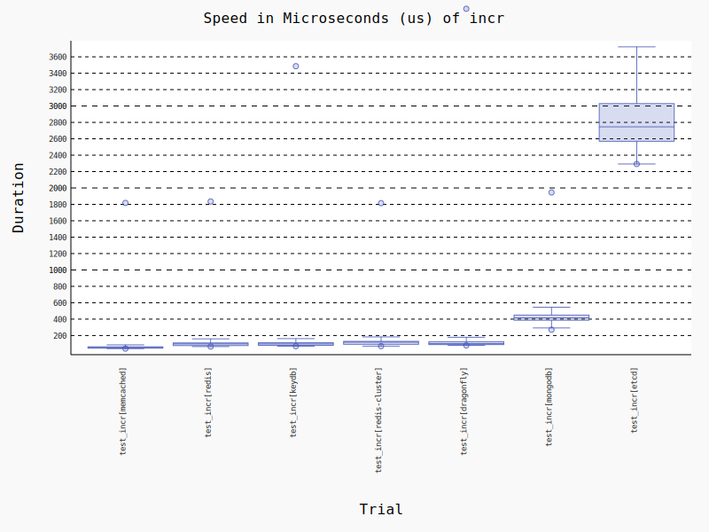

# Key Value Store benchmarks with python client libraries

Benchmarks for some common operations with Memcached, Redis, Redis Cluster, Dragonfly, MongoDB and Etcd.

The benchmarks were run using [pytest-benchmark](https://pytest-benchmark.readthedocs.io/en/latest/) with the parameters:
- min_rounds=5
- min_time=0.000005
- max_time=1.0
- calibration_precision=10
- warmup=True
- warmup_iterations=100000

## Benchmark environment:
- Python version: 3.11.0
- Processor: x86_64
- Physical cores: 4
- Total cores: 8
- Max Frequency: 4200.00Mhz 
- Min Frequency: 800.00Mhz
- Total Memory: 31.23GB


## Server versions:
- Redis: 7.0.7
- Dragonfly: df-v0.13.1
- Memcached: 1.6.18
- Redis Cluster: 7.0.7
- MongoDB: 6.0.3
- Etcd: 3.5.6


## Python client libraries used:
- Redis/Redis Cluster/Dragonfly: [redis-py](https://github.com/redis/redis-py)
- Memcached: [pymemcache](https://github.com/pinterest/pymemcache)
- MongoDB: [pymongo](https://github.com/mongodb/mongo-python-driver)
- Etcd: [etcd3](https://github.com/kragniz/python-etcd3)

The associated implementations used in the benchmark can be found in [kv_benchmark.py](./kv_benchmark.py)

## Operations

### Get
- Redis/Redis Cluster/Dragonfly: [GET](https://redis.io/commands/get/)
- Memcached: [get](https://github.com/memcached/memcached/wiki/Commands#get)
- MongoDB: [findOne](https://www.mongodb.com/docs/manual/reference/method/db.collection.findOne/)
- Etcd: [get](https://python-etcd3.readthedocs.io/en/latest/usage.html#etcd3.Etcd3Client.get)


### Set
- Redis/Redis Cluster/Dragonfly: [SET](https://redis.io/commands/set/)
- Memcached: [set](https://github.com/memcached/memcached/wiki/Commands#set)
- MongoDB: [replaceOne with upsert](https://www.mongodb.com/docs/manual/reference/method/db.collection.replaceOne/)
- Etcd: [put](https://python-etcd3.readthedocs.io/en/latest/usage.html#etcd3.Etcd3Client.put)


### Increment
- Redis/Redis Cluster/Dragonfly: [INCRBY](https://redis.io/commands/incrby/)
- Memcached: [incr](https://github.com/memcached/memcached/wiki/Commands#incrdecr)
- MongoDB: [findOneAndUpdate with conditional $add and upsert](https://www.mongodb.com/docs/manual/reference/method/db.collection.findOneAndUpdate/)
- Etcd: [transaction with conditional put when key doesn't exist and get+local increment+put with another transaction with a CAS (in a loop) if it does](https://python-etcd3.readthedocs.io/en/latest/usage.html#etcd3.Etcd3Client.transactionhttps://python-etcd3.readthedocs.io/en/latest/usage.html#etcd3.Etcd3Client.transactionhttps://python-etcd3.readthedocs.io/en/latest/usage.html#etcd3.Etcd3Client.transactionhttps://python-etcd3.readthedocs.io/en/latest/usage.html#etcd3.Etcd3Client.transactionhttps://python-etcd3.readthedocs.io/en/latest/usage.html#etcd3.Etcd3Client.transactionhttps://python-etcd3.readthedocs.io/en/latest/usage.html#etcd3.Etcd3Client.transactionhttps://python-etcd3.readthedocs.io/en/latest/usage.html#etcd3.Etcd3Client.transactionhttps://python-etcd3.readthedocs.io/en/latest/usage.html#etcd3.Etcd3Client.transactionhttps://python-etcd3.readthedocs.io/en/latest/usage.html#etcd3.Etcd3Client.transaction)



## Tabulated Results

```

------------------------------------------------ benchmark 'get': 6 tests -----------------------------------------------
Name (time in us)                Min                    Max                Mean            Rounds  OPS (Kops/s)          
-------------------------------------------------------------------------------------------------------------------------
test_get[memcached]          45.2120 (1.0)         202.1790 (1.0)       68.9827 (1.0)       21897       14.4964 (1.0)    
test_get[redis]              65.1423 (1.44)        341.8848 (1.69)      95.0764 (1.38)      15199       10.5179 (0.73)   
test_get[redis-cluster]      65.3975 (1.45)      3,179.2205 (15.72)     78.0307 (1.13)      15136       12.8155 (0.88)   
test_get[dragonfly]          82.5822 (1.83)     13,884.0955 (68.67)    126.4781 (1.83)      12224        7.9065 (0.55)   
test_get[etcd]              237.2134 (5.25)      1,232.0541 (6.09)     357.6240 (5.18)       4136        2.7962 (0.19)   
test_get[mongodb]           262.8751 (5.81)        818.6810 (4.05)     424.2654 (6.15)       3783        2.3570 (0.16)   
-------------------------------------------------------------------------------------------------------------------------

------------------------------------------------- benchmark 'incr': 6 tests -------------------------------------------------
Name (time in us)                   Min                    Max                  Mean            Rounds          OPS          
-----------------------------------------------------------------------------------------------------------------------------
test_incr[memcached]            41.3544 (1.0)         194.7992 (1.0)         58.8776 (1.0)       24269  16,984.3860 (1.0)    
test_incr[redis]                66.2487 (1.60)        341.2999 (1.75)       100.0595 (1.70)      14967   9,994.0496 (0.59)   
test_incr[redis-cluster]        75.0273 (1.81)        351.8350 (1.81)       122.6639 (2.08)      13357   8,152.3604 (0.48)   
test_incr[dragonfly]            83.1727 (2.01)      1,166.4387 (5.99)       122.6506 (2.08)      11584   8,153.2443 (0.48)   
test_incr[mongodb]             329.6547 (7.97)        723.3471 (3.71)       490.7860 (8.34)       3177   2,037.5479 (0.12)   
test_incr[etcd]              2,899.9448 (70.12)    11,469.9584 (58.88)    5,367.0000 (91.16)       444     186.3238 (0.01)   
-----------------------------------------------------------------------------------------------------------------------------

------------------------------------------------- benchmark 'set': 6 tests -------------------------------------------------
Name (time in us)                  Min                   Max                  Mean            Rounds           OPS          
----------------------------------------------------------------------------------------------------------------------------
test_set[memcached]             4.2282 (1.0)         55.1967 (1.0)          4.8496 (1.0)      115830  206,202.1014 (1.0)    
test_set[redis]                68.1151 (16.11)      463.5993 (8.40)       100.1397 (20.65)     14715    9,986.0456 (0.05)   
test_set[redis-cluster]        76.6627 (18.13)      224.1936 (4.06)       114.6867 (23.65)     13117    8,719.4060 (0.04)   
test_set[dragonfly]            84.0854 (19.89)      325.4488 (5.90)       128.0769 (26.41)     11581    7,807.8103 (0.04)   
test_set[etcd]              1,057.9843 (250.22)   6,859.9153 (124.28)   2,491.9424 (513.84)      780      401.2934 (0.00)   
test_set[mongodb]           2,091.8455 (494.74)   6,695.8405 (121.31)   2,877.8630 (593.42)     2749      347.4801 (0.00)   
----------------------------------------------------------------------------------------------------------------------------

Legend:
  Outliers: 1 Standard Deviation from Mean; 1.5 IQR (InterQuartile Range) from 1st Quartile and 3rd Quartile.
  OPS: Operations Per Second, computed as 1 / Mean

```

## Development

To run these benchmarks locally you'll need a working docker & docker-compose installation.

1. Install the requirements: `pip install --no-binary=protobuf requirements.txt`
2. Run the benchmarks: `make generate` (this task will also update the report in this README)
3. Or, run the benchmarks directly: `pytest`

