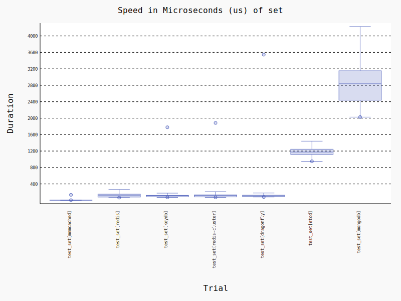

# Key Value Store benchmarks with python client libraries

Benchmarks for some common operations with Memcached, Redis, Redis Cluster, Dragonfly, KeyDB, MongoDB and Etcd.

The benchmarks were run using [pytest-benchmark](https://pytest-benchmark.readthedocs.io/en/latest/) with the parameters:
- min_rounds=5
- min_time=0.000005
- max_time=1.0
- calibration_precision=10
- warmup=True
- warmup_iterations=100000

## Benchmark environment:
- Python version: 3.13.0
- Processor: x86_64
- Physical cores: 4
- Total cores: 8
- Max Frequency: 4200.00Mhz 
- Min Frequency: 800.00Mhz
- Total Memory: 31.29GB


## Server versions:
- Redis: 7.4.2
- Dragonfly: 7.4.0
- KeyDB: 6.3.4
- Memcached: 1.6.37
- Redis Cluster: 7.4.2
- MongoDB: 8.0.5
- Etcd: 3.5.18


## Python client libraries used:
- Redis/Redis Cluster/Dragonfly/KeyDB: [redis-py](https://github.com/redis/redis-py)
- Memcached: [pymemcache](https://github.com/pinterest/pymemcache)
- MongoDB: [pymongo](https://github.com/mongodb/mongo-python-driver)
- Etcd: [etcd3](https://github.com/kragniz/python-etcd3)

The associated implementations used in the benchmark can be found in [kv_benchmark.py](./kv_benchmark.py)

## Operations

### Get
- Redis/Redis Cluster/Dragonfly/KeyDB: [GET](https://redis.io/commands/get/)
- Memcached: [get](https://github.com/memcached/memcached/wiki/Commands#get)
- MongoDB: [findOne](https://www.mongodb.com/docs/manual/reference/method/db.collection.findOne/)
- Etcd: [get](https://python-etcd3.readthedocs.io/en/latest/usage.html#etcd3.Etcd3Client.get)


### Set
- Redis/Redis Cluster/Dragonfly/KeyDB: [SET](https://redis.io/commands/set/)
- Memcached: [set](https://github.com/memcached/memcached/wiki/Commands#set)
- MongoDB: [replaceOne with upsert](https://www.mongodb.com/docs/manual/reference/method/db.collection.replaceOne/)
- Etcd: [put](https://python-etcd3.readthedocs.io/en/latest/usage.html#etcd3.Etcd3Client.put)



### Increment
- Redis/Redis Cluster/Dragonfly/KeyDB: [INCRBY](https://redis.io/commands/incrby/)
- Memcached: [incr](https://github.com/memcached/memcached/wiki/Commands#incrdecr)
- MongoDB: [findOneAndUpdate with conditional $add and upsert](https://www.mongodb.com/docs/manual/reference/method/db.collection.findOneAndUpdate/)
- Etcd: [transaction with conditional put when key doesn't exist and get+local increment+put with another transaction with a CAS (in a loop) if it does](https://python-etcd3.readthedocs.io/en/latest/usage.html#etcd3.Etcd3Client.transactionhttps://python-etcd3.readthedocs.io/en/latest/usage.html#etcd3.Etcd3Client.transactionhttps://python-etcd3.readthedocs.io/en/latest/usage.html#etcd3.Etcd3Client.transactionhttps://python-etcd3.readthedocs.io/en/latest/usage.html#etcd3.Etcd3Client.transactionhttps://python-etcd3.readthedocs.io/en/latest/usage.html#etcd3.Etcd3Client.transactionhttps://python-etcd3.readthedocs.io/en/latest/usage.html#etcd3.Etcd3Client.transactionhttps://python-etcd3.readthedocs.io/en/latest/usage.html#etcd3.Etcd3Client.transactionhttps://python-etcd3.readthedocs.io/en/latest/usage.html#etcd3.Etcd3Client.transactionhttps://python-etcd3.readthedocs.io/en/latest/usage.html#etcd3.Etcd3Client.transaction)


## Tabulated Results

```

----------------------------------------------- benchmark 'get': 7 tests -----------------------------------------------
Name (time in us)                Min                   Max                Mean            Rounds  OPS (Kops/s)          
------------------------------------------------------------------------------------------------------------------------
test_get[memcached]          44.1220 (1.0)      1,995.8450 (2.60)      59.4772 (1.0)       22647       16.8132 (1.0)    
test_get[redis-cluster]      63.4010 (1.44)       768.8960 (1.0)       82.3044 (1.38)      15819       12.1500 (0.72)   
test_get[redis]              66.2390 (1.50)     2,039.4000 (2.65)      93.4518 (1.57)      15044       10.7007 (0.64)   
test_get[keydb]              70.2590 (1.59)     2,472.0360 (3.22)     125.6638 (2.11)      14100        7.9577 (0.47)   
test_get[dragonfly]          79.1790 (1.79)     3,876.9850 (5.04)     121.7834 (2.05)      12548        8.2113 (0.49)   
test_get[mongodb]           201.4800 (4.57)     2,622.6200 (3.41)     330.6835 (5.56)       4963        3.0240 (0.18)   
test_get[etcd]              250.9350 (5.69)     2,364.1110 (3.07)     396.2406 (6.66)       4120        2.5237 (0.15)   
------------------------------------------------------------------------------------------------------------------------

------------------------------------------------ benchmark 'incr': 7 tests -------------------------------------------------
Name (time in us)                   Min                   Max                  Mean            Rounds          OPS          
----------------------------------------------------------------------------------------------------------------------------
test_incr[memcached]            40.2180 (1.0)      1,817.3710 (1.00)        56.1344 (1.0)       24637  17,814.3931 (1.0)    
test_incr[redis]                65.2540 (1.62)     1,835.4530 (1.01)        99.8935 (1.78)      15051  10,010.6640 (0.56)   
test_incr[keydb]                69.5520 (1.73)     3,485.7830 (1.92)       100.6925 (1.79)      14242   9,931.2300 (0.56)   
test_incr[redis-cluster]        70.6180 (1.76)     1,814.7280 (1.0)        115.7719 (2.06)      14342   8,637.6750 (0.48)   
test_incr[dragonfly]            79.4910 (1.98)     4,186.4150 (2.31)       112.2945 (2.00)      12388   8,905.1536 (0.50)   
test_incr[mongodb]             270.9040 (6.74)     1,945.0900 (1.07)       419.4806 (7.47)       3756   2,383.9006 (0.13)   
test_incr[etcd]              2,292.5840 (57.00)    8,746.3500 (4.82)     2,950.6652 (52.56)       457     338.9066 (0.02)   
----------------------------------------------------------------------------------------------------------------------------

-------------------------------------------------- benchmark 'set': 7 tests -------------------------------------------------
Name (time in us)                  Min                    Max                  Mean            Rounds           OPS          
-----------------------------------------------------------------------------------------------------------------------------
test_set[memcached]             4.4965 (1.0)         134.9115 (1.0)          5.6263 (1.0)      110473  177,736.2718 (1.0)    
test_set[redis]                68.1550 (15.16)     8,036.0600 (59.57)      129.2698 (22.98)     14578    7,735.7594 (0.04)   
test_set[keydb]                72.7130 (16.17)     1,777.8250 (13.18)      109.7658 (19.51)     13721    9,110.3017 (0.05)   
test_set[redis-cluster]        72.9830 (16.23)     1,883.1210 (13.96)      116.4642 (20.70)     13879    8,586.3287 (0.05)   
test_set[dragonfly]            82.3640 (18.32)     3,544.8350 (26.28)      114.8422 (20.41)     12033    8,707.6011 (0.05)   
test_set[etcd]                950.2520 (211.33)   10,648.0570 (78.93)    1,291.2998 (229.51)     1061      774.4135 (0.00)   
test_set[mongodb]           2,025.6080 (450.49)   10,925.8610 (80.99)    2,981.0120 (529.83)     3807      335.4565 (0.00)   
-----------------------------------------------------------------------------------------------------------------------------

Legend:
  Outliers: 1 Standard Deviation from Mean; 1.5 IQR (InterQuartile Range) from 1st Quartile and 3rd Quartile.
  OPS: Operations Per Second, computed as 1 / Mean

```

## Development

To run these benchmarks locally you'll need a working docker & docker-compose installation.

1. Install the requirements: `pip install --no-binary=protobuf requirements.txt`
2. Run the benchmarks: `make generate` (this task will also update the report in this README)
3. Or, run the benchmarks directly: `pytest`

