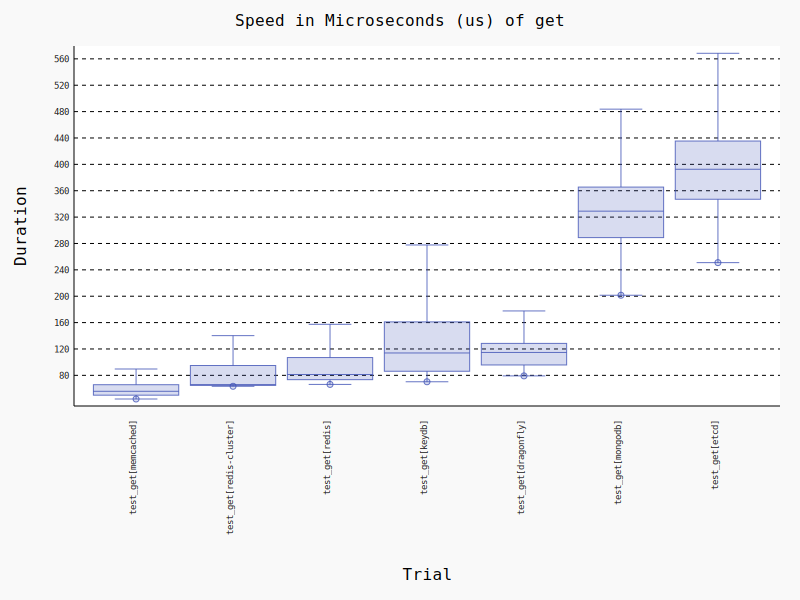

# Key Value Store benchmarks with python client libraries

Benchmarks for some common operations with Memcached, Redis, Redis Cluster, Dragonfly, MongoDB and Etcd.

Server versions:
- Redis: 7.0.7
- Dragonfly: df-v0.13.1
- Memcached: 1.6.18
- Redis Cluster: 7.0.7
- MongoDB: 6.0.3
- Etcd: 3.5.6


Python client libraries used:
- Redis: [redis-py](https://github.com/redis/redis-py)
- Memcached: [pymemcache](https://github.com/pinterest/pymemcache)
- MongoDB: [pymongo](https://github.com/mongodb/mongo-python-driver)
- Etcd: [etcd3](https://github.com/kragniz/python-etcd3)

The associated wrappers used in the benchmark can be found in [kv_benchmark.py](./kv_benchmark.py)

## Get


## Set


## Increment


## Tabulated Results

```

----------------------------------------------- benchmark 'get': 6 tests -----------------------------------------------
Name (time in us)                Min                   Max                Mean            Rounds  OPS (Kops/s)          
------------------------------------------------------------------------------------------------------------------------
test_get[memcached]          46.3184 (1.0)      5,909.1523 (27.26)     61.3407 (1.0)       21356       16.3024 (1.0)    
test_get[redis]              62.1602 (1.34)       239.3406 (1.10)      82.4509 (1.34)      15562       12.1284 (0.74)   
test_get[redis-cluster]      68.0443 (1.47)       216.8007 (1.0)       74.6553 (1.22)      14678       13.3949 (0.82)   
test_get[dragonfly]          84.8491 (1.83)       382.7866 (1.77)     118.6544 (1.93)      12018        8.4278 (0.52)   
test_get[etcd]              252.3642 (5.45)     1,237.1317 (5.71)     371.3603 (6.05)       3925        2.6928 (0.17)   
test_get[mongodb]           310.4750 (6.70)       673.9050 (3.11)     454.8687 (7.42)       3148        2.1984 (0.13)   
------------------------------------------------------------------------------------------------------------------------

------------------------------------------------- benchmark 'incr': 6 tests -------------------------------------------------
Name (time in us)                   Min                    Max                  Mean            Rounds          OPS          
-----------------------------------------------------------------------------------------------------------------------------
test_incr[memcached]            42.6341 (1.0)         516.4538 (1.40)        60.0447 (1.0)       23666  16,654.2721 (1.0)    
test_incr[redis]                65.4459 (1.54)        369.7481 (1.0)         95.5970 (1.59)      15123  10,460.5839 (0.63)   
test_incr[redis-cluster]        78.2330 (1.83)        385.9941 (1.04)       117.1482 (1.95)      12675   8,536.1938 (0.51)   
test_incr[dragonfly]            87.6244 (2.06)     13,741.9477 (37.17)      116.0758 (1.93)      11915   8,615.0612 (0.52)   
test_incr[mongodb]             374.3023 (8.78)        804.1039 (2.17)       513.0592 (8.54)       2751   1,949.0928 (0.12)   
test_incr[etcd]              2,320.8167 (54.44)    11,392.6902 (30.81)    4,488.7945 (74.76)       397     222.7770 (0.01)   
-----------------------------------------------------------------------------------------------------------------------------

-------------------------------------------------- benchmark 'set': 6 tests -------------------------------------------------
Name (time in us)                  Min                    Max                  Mean            Rounds           OPS          
-----------------------------------------------------------------------------------------------------------------------------
test_set[memcached]             5.7518 (1.0)         263.2160 (1.18)         6.8135 (1.0)      174196  146,766.8693 (1.0)    
test_set[redis]                67.8878 (11.80)       262.8136 (1.17)        99.5447 (14.61)     14378   10,045.7369 (0.07)   
test_set[redis-cluster]        79.8628 (13.88)       223.7316 (1.0)        111.1379 (16.31)     12387    8,997.8281 (0.06)   
test_set[dragonfly]            85.0223 (14.78)     2,627.7844 (11.75)      130.3632 (19.13)     11527    7,670.8753 (0.05)   
test_set[mongodb]           2,042.7145 (355.14)   12,014.7709 (53.70)    2,827.5082 (414.98)     2650      353.6683 (0.00)   
test_set[etcd]              2,146.6706 (373.21)   14,829.1215 (66.28)    2,710.9368 (397.88)     1048      368.8762 (0.00)   
-----------------------------------------------------------------------------------------------------------------------------

Legend:
  Outliers: 1 Standard Deviation from Mean; 1.5 IQR (InterQuartile Range) from 1st Quartile and 3rd Quartile.
  OPS: Operations Per Second, computed as 1 / Mean

```
